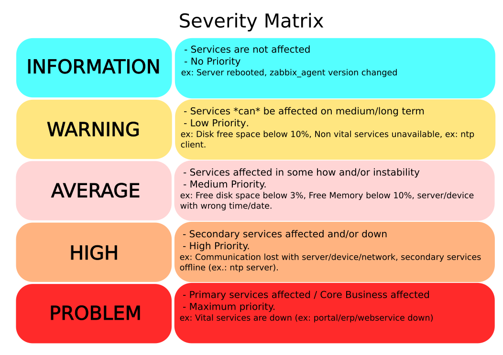

## Created by Lucas Afonso Kremer

### Requirements:

```
Server:
        a) Zabbix Server on version 3.4;
        b) Templates are used on Zabbix Server 3.0.x too, but you will need change some stuffs, like "Allow manual close" option, before use them;
        c) All itens are used with UserParameter and ACTIVE itens.
```
### Clone the template to your machine, or just download it. Import the template on Zabbix Server (more details about an specific template, will be avaible on the folder).

### Clone example:
```sh
git clone https://github.com/lucasafonsokremer/zabbix-templates.git
```

### All templates are based on the severity matrix below.

